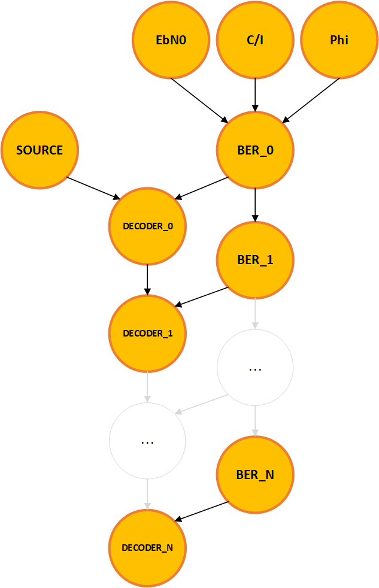
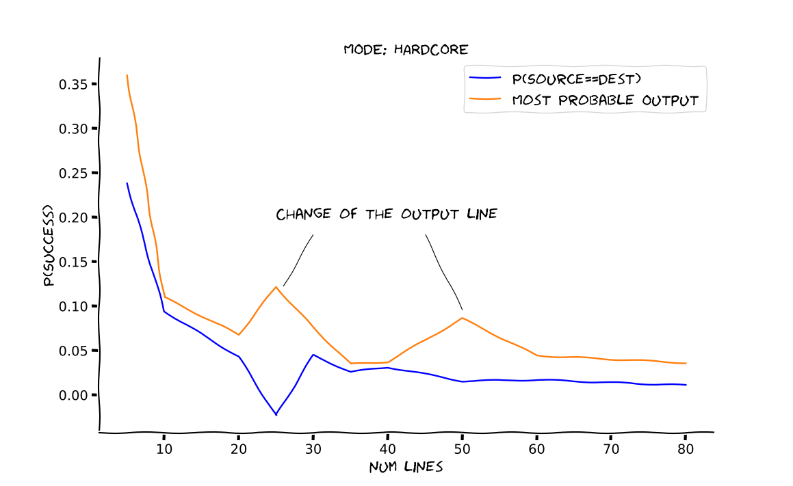
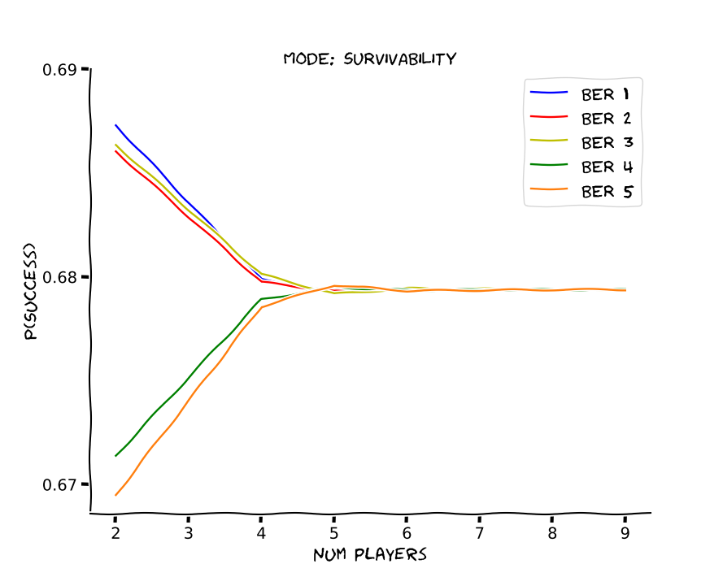
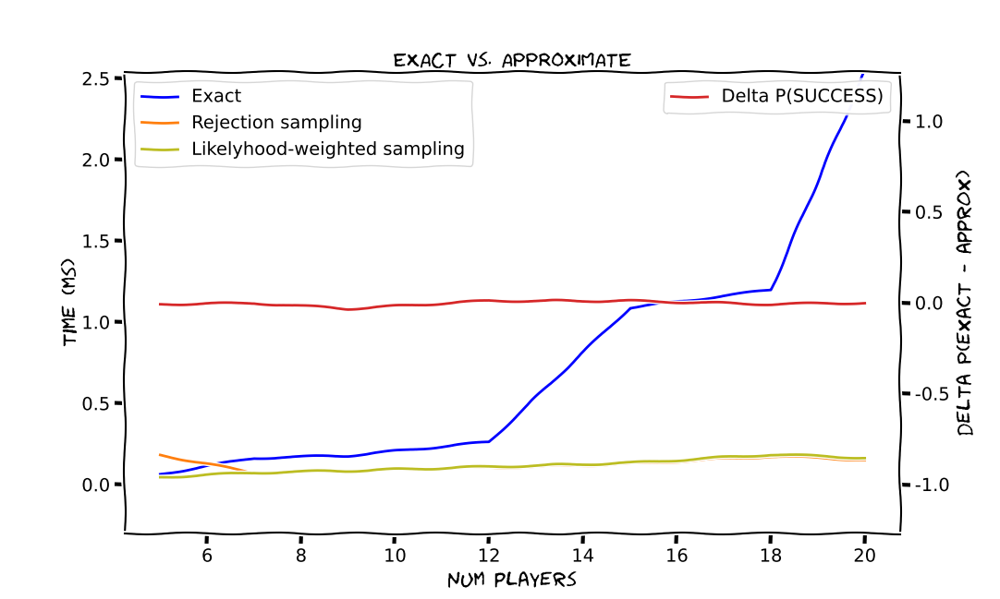
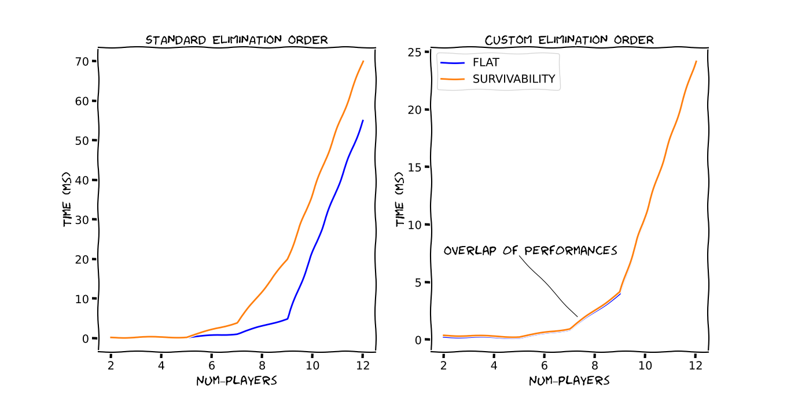

# WeWereOnABreak
An implementation of the "Chinese whispers" game with a Bayesian Network.

## Abstract
This project aims at exploiting the features and the strengths of Bayesian Networks for the implementation of the "Chinese whisperers" game. The presented
model allows us to determine whether the original message given as input goes through some changes due to erroneous word-of-mouth where the presence of noise
is taken into account, too. For this purpose, it has been created a custom dataset which includes a score representing the tendency of each sentence to mutate based
on the probability of each of its words being misspelt.

## 1. Introduction

The original *Chinese whispers* game, also known as the
Telephone game , requires more than 2 players to pass a message to each other, whispering it so that the other cannot
listen. 

The goal of the game, or maybe the hoped result, is to keep unchanged the
original message through the whole word of mouth process.
For the purpose of making the game more interesting and to better exploit the Bayesian
Network's potential, the following tweaks have been made:
  1. each player takes the input sentence, translates it into Italian and then translates it back to English before passing the message to the next player
  2. communications between each pair of players are affected by noise

The new feature (1) is included to add some more unpredictability.
The translation process makes it easier for the sense of a misspelt word to swap, indeed. Let's make
a simple example. If in the original message there's the word "won't" and the word "wan't" arrives instead, after the double translation the sentence's sense changes quite
drastically. The game is further made more meaningful from an engineering perspective by adding
some practical disturbance causes. Players can indeed be seen as endpoints of a telematic
communication, along whose path noise may occur due to one or more of the following
parameters:
- EbN0: bit Energy to Noise spectral density ratio
-  C/I: Carrier to Interference ratio
- Phi: Dopler phase shift

The values and the combinations of the latter make the noise to be classiffed according
`Bit Error Rate` to a (BER) scale, representing the frequency with which a swap of bit
occurs with respect to the length of the transmitted message, which ranges between the
values `BER 1` and `BER 5`, being the former the best-case scenario.

The dataset has been built from scratch starting from both the English and Italian
captions from the whole first season of the series *Friends*. The score of each of the
available words is computed according to the number of synonyms and their possible
misspellings. All of the previous statistics are computed starting from the dataset listed
in the bibliography.

The game provides three different modalities each of which implements a different struc-
ture for the Bayesian network, with consequent different types of queries the player can
make. Given an input message M, the modalities below make it possible to retrieve the
following information 
- flat mode : the score associated with M affects the CPDs' values in the BN's
structure. The player can query the probability of getting the same sentence at
the end of the path;
- survivability mode : the same as flat with some differences in the structure of the Bayesian model which shall be pointed out next;
- hardcore mode : the most complex and expensive mode that analyzes the proba- bility of getting to a specific output sentence starting from
M;

Every modality's features are net of the possibility to specify and analyze the noise presence.

## 2. Dataset and probability distributions
Starting from the synonym and misspelling statistics, the
switching probability of a line is computed according to the words composing it. Such a score is higher as higher is
the probability of getting an error. As a rule of thumb, we want the score to follow the
principles below:
- the longer the word the higher the score - the same Bit Error Rate level affects more a word with more letters (more bits)
- the higher the number of synonyms the lower the score - in theory, the more are
the synonyms of a word, the higher the probability of a correct translation even
after a misspelling, so the lower the switching score
- the higher the number of possible misspellings, the higher the score

Each word  is thus associated with a score 

          
where :
- the smoothing factor  is necessary in the case a particular word has neither synonyms nor misspellings available in the statistics dataset;
-  returns the length of the word;
-  returns the number of synonyms for the given word;
-  returns the number of possible misspellings for the given word;

For every message  in the dataset, the score  is then computed as the sum of its words' score

and then normalized over all the lines' scores.

The network deals with the probabilities of switching from each source message  to every destination message . In this regard, a  for each couple of lines is calculated as the degree of similarity between the Italian translation of the respective messages

where the translation score 
keeps track of the number of words the two sentences share. As before, the latter score is normalized over the data so as to obtain a probabilistic measure.

The final *switching score* for each available message  is then computed as

where the "*sample*" function return a random set of size *batch_dim* of different messages  from the dataset *df* that are used to compute a statistically consistent average of the *switching score* for the particular source message.

Regarding the noise condition along the communication path, the model is meant as a sort of transition system where the noise level of the previous endpoint, expressed in terms of BER, affects the clearness of the communication between the next pair of players. To model the likelihood of occurrence of an error, the Poisson distribution is used to express how many hops, in our case, how many message exchanges, are necessary to expect an error to verify.

Given such distributions, the noise level can either remain the same, improve or get worse according to the transition diagram below.

The way BER levels affect the switching probability of lines is finally computed as an exponential distribution.  As already mentioned, we expect to witness an error in a fewer number of steps as the noise condition worsens.  Appropriately setting the value of  to decrease as the  level grows, the final probability  of getting an error for a message  with noise condition  is modelled as

where the cumulative exponential distribution , which describes the likelihood of a bit flipping in a single message exchange, is weighted by , whose value changes according to the chosen game modality:
- *hardcore* modality:
, namely the probability of switching from $\mathcal{M}_m$ to every other message ;

- *survivability* modality:
,
being  the average score of all the lines in the dataset;

- *flat* modality:
,
being  as before;

The measure  represents thus the probability of success for the message  under noise condition .

To conclude, the Bit Error Rate levels' probability depending on the values of the telematic parameter above mentioned, are taken from the paper "Hector Reyes, Sriram Subramaniam, Naima Kaabouch - *A Bayesian Network Model of the Bit Error Rate for Cognitive Radio Network*".

## 3. Bayesian Network's structure
The Bayesian Network structure is built to satisfy every modality of the game. In particular, the relations between the nodes are the same whilst the condition probability tables change to meet each modality's needs.

The Network's structure is meant to represent as faithfully as possible how players line up to play the game. Since we want to implement an acyclic network, we shall consider the last node of the chain to be a duplicate of the input one. Questioning whether the original message has remained the same during the game, here is translated into two different queries according to the chosen modality:
-  flat and survivability node: given as input a message, check whether each player has returned the same message received as input
- hardcore mode: check whether the line returned by the last node is the same as the original one

In the former case, the success of each message exchange is measured as a boolean variable. Querying the network about the probability of success of the node  means asking whether the message the player $i$ has received as input is the same he/she passes forward. So, to obtain information about how probable it is to get the same message at the end of the chain, one has to query the probability of all the nodes to succeed.

In the hardcore mode, we can only directly check the output of the last node. In this type of structure, thanks to the CPDs this particular modality implements, we could also observe a line changing during the path and then turning back to the source one. This modality is indeed a more powerful and expressive tool, which requires though, as mentioned above, to constrain the number  of possible line, being the CPD cardinality of , net of the presence of the noise variable.

Although the three modalities have these different approaches, the network's backbone is the same. Therefore, each player is represented as a node whose parents are the previous player and the current noise condition. The latter factor is expressed itself as a connected chain of nodes where each of them represents the noise condition that will characterize the communication path between its child player node and the next one. 

The structure of our Bayesian Network is shown in figure \ref{fig:bn_struct}, wherein players are encoded as nodes named , whilst noise nodes  are named after the scale the range in, and whose numeration refers to which path they affect. Finally, the *EbN0*, *C/I* and *Phi* nodes are the implementations of the above disturbance factors, while the so-called *SOURCE* handle the choice of the original message. In the queries shown below, the latter node shall always be used as an evidence parameter.

As the last *DECODER* node is s way to represent the *SOURCE* node in order to avoid cyclicity, implementing the game for $n$ players requires $n+1$ nodes to be used: $n$ *DECODER*s plus the *SOURCE* node.

 
As the BERs' CPD is a trivial implementation of the transition probabilities shown before, let us focus on the player's related nodes and how their structure changes according to the chosen game modality.

Note that, hereinafter we shall neglect the presence of *BER* nodes among the parenthood relationship with the other nodes. Just consider the CPDs shown below as a reduced form whose cardinality must be enlarged by a factor 5 (the levels BER ranges in), simply multiplying each cell in the tables below by the correspondent probability measure according to the distribution showed above.

- As far as the *survivability* modality is concerned, the *SOURCE* node has a dummy CPD composed as an array of cardinality equal to the dataset dimension, i.e., equal to the number of all available messages. Since all queries shall have as evidence the original message, their probability values are taken randomly.
The *DECODER* nodes are thus meant to return a boolean value to express whether the input message remained or not unchanged after the last communication hop. For this reason, given the way the *SOURCE* is made, the first *DECODER*'s CPD is different from the next ones in terms of the cardinality of their parent nodes.All the other , with 0">, have instead a reduced cardinality where the probability of success is computed as the average over all the messages in the dataset, being the knowledge of the current input message, and thus of its score, not available in this type of Network's structure.

- The *flat* modality has been conceived as an attempt to include the evidence about the input message automatically in the queries, without stating it explicitly. For this purpose, the CPDs are dynamically recomputed each time a new message is given as input. 
Being the *SOURCE* node a "boolean variable", all *DECODER*s share the same CPD, as they have the same cardinality, which is the same used for the  with 1"> in the the \textit{survivability} mode.

- The most complex set of nodes are those implemented in the *hardcore* modality, as we wish to keep track of the possible switches. In practice, since the number of instances would become unmanageable as the dataset's size grows, the  *hardcore* modality can be used only on a smaller set of possible messages from the original set. where data is already normalized to make their sum unitary.

## 4. Queries and performances

As already mentioned, two possible queries for checking the success of the whole message exchange process can be made depending on the modality the player has chosen. The *hardcore* modality, leveraging on its higher expressiveness, make it possible to analyse how often and to which particular other sentences the input message changes into. On the other hand, the number of possible messages must be accounted for, as the cardinalities grow in a quadratic fashion with the dimension of the dataset, which also includes a narrowing of all probabilities.

The plot below shows how the probability of success of the input line and the most probable output from the network behave as the dimension of the message dataset increases.

The latter behaviour is particularly interesting if we think our game to be played by an extremely high number of players. A particular message could indeed be prone to undergo a misspelling error but, due to the number and type of its words' synonyms, may come back to the original form after a certain number of hops.

Using a more simple structure for performance reasons, we can observe a convergence in the probability of success for any noise condition as the network's length increases, i.e., the more players join the game.

This trend can be explained in different ways:
-  being the probabilistic structure of the network nodes the same for all  with 0">, the effect of noise, given by the values of BER nodes, is more impactful for a lower number of players. Note that, the statistics in figure \ref{fig:ber_comp} are taken from a simple query , without any evidence but the first BER node condition. This produces a probability outcome that is the product/summation of almost all values in the CPD tables. If the structure dimension increase, the final result tends to be the same;

- as the network is highly connected, namely since all probability values multiply with each other, we might expect these floating-point measures to overflow;

The differences between the two approaches are well known. While the precision of exact queries can be reached by enlarging the number of samples, the computational cost may diverge for high-dimensional networks in the case of exact methods. Our model is thought to be extendable to a theoretically undefined number of players, which could lead to an explosion in the time performances, especially in the case of the absence of evidence nodes in queries. Let us take the cheapest modality in terms of space occupancy of its CPD tables and show the performances of the two different methods as the number of players increases.

As we expected, the growth of dimensionality highly affects the Variable Elimination algorithm, while the sampling method outperforms it. With a proper number of samples, we witness that the two query types' outcome is almost the same. 

Note that all the previous exact queries were performed without any precise elimination order. Performances can be therefore boosted by a smart elimination that considers the smallest domain variables later in the computation. 

For instance, *flat* and *survivability* modes differ only on how the SOURCE node is made, whose dimension, especially in the *survivability* case, may influence the computation if not eliminated at first. As shown, the computation actually improves if SOURCE is considered as soon as the algorithm starts. 

